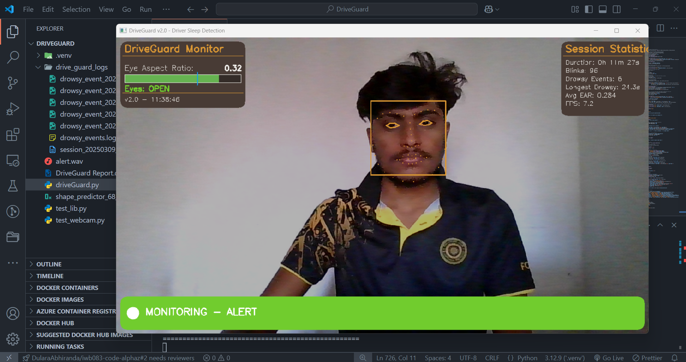

<div align="center">

# 🚗 DriveGuard - Driver Drowsiness Detection System 🚗

 <!-- Replace 'path/to/your/banner-image.jpg' with your image file -->

**_Preventing road accidents caused by driver fatigue through cutting-edge technology_**

[](https://opensource.org/licenses/MIT)
[](http://makeapullrequest.com)
[](https://badge.fury.io/py)

</div>

---

## 🌟 About DriveGuard

DriveGuard is a sophisticated system aimed at enhancing road safety by detecting early signs of driver fatigue through real-time monitoring and analysis of facial features. Using advanced computer vision techniques and machine learning, DriveGuard alerts drivers with timely visual and audio cues, potentially saving lives by preventing fatigue-related incidents on the road.

## 🚀 Features

- **Real-Time Facial Monitoring**: Utilizes live video to continuously watch for signs of drowsiness in a driver's facial expressions and eye movements.
- **Audio-Visual Alerts**: Emits audible alarms and displays visual warnings on the user interface when signs of fatigue are detected.
- **Adaptive Sensitivity**: Features customizable settings for detection sensitivity, catering to different operating conditions and individual preferences.
- **Robust Logging System**: Keeps detailed logs of all detection events for further analysis and system enhancement.
- **Interactive Dashboard**: Offers a user-friendly graphical interface displaying real-time detection data, system status, and controls.

## 📦 Installation

To get started with DriveGuard, follow these steps:

```bash
# Clone the repository
git clone https://github.com/yourusername/DriveGuard.git
cd DriveGuard

# Set up a virtual environment
python -m venv venv
source venv/bin/activate  # On Windows use `venv\Scripts\activate`

# Install dependencies
pip install -r requirements.txt
⚙️ Usage
To launch the DriveGuard system, run the following command in your terminal:

bash
Copy
python main.py
You can adjust the detection settings through command-line arguments:

bash
Copy
python main.py --camera 0 --ear 0.25 --frames 3 --drowsy 5.0 --recovery 5.0
🛠 Technologies
DriveGuard is built with:

Python: For core functionalities.
OpenCV: For capturing and processing video frames.
dlib: For facial landmark detection.
NumPy: For handling numerical operations.
Pygame: For managing audio notifications.
🤝 Contributing
Contributions are what make the open source community such an amazing place to learn, inspire, and create. Any contributions you make are greatly appreciated.

If you have a suggestion that would make this better, please fork the repo and create a pull request. You can also simply open an issue with the tag "enhancement". Don't forget to give the project a star! Thanks again!

Fork the Project
Create your Feature Branch (git checkout -b feature/AmazingFeature)
Commit your Changes (git commit -m 'Add some AmazingFeature')
Push to the Branch (git push origin feature/AmazingFeature)
Open a Pull Request
🔗 Links
Visit my Portfolio: abhiranda.me
📝 License
Distributed under the MIT License. See LICENSE for more information.

📬 Contact
Project Link: https://github.com/yourusername/DriveGuard
Personal Website: abhiranda.me
